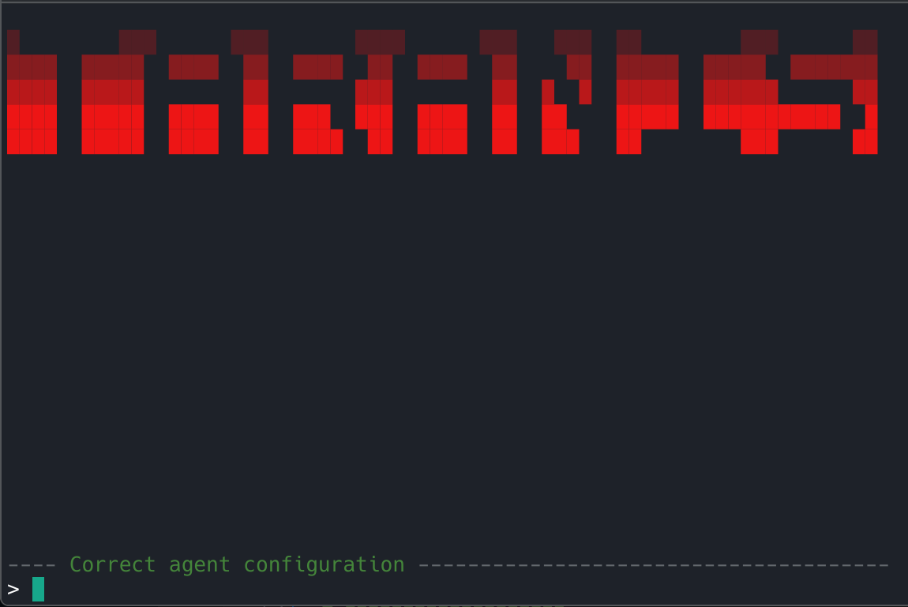

# open-taranis

Python framework for AI agents logic-only coding with streaming, tool calls, and multi-LLM provider support.

Only the **"fairly stable"** versions are published on PyPi, but to get the latest experimental versions, clone this repository and install it !

## Installation

```bash
pip install open-taranis --upgrade
```
For package on **PyPi**


**or**
```bash
git clone https://github.com/SyntaxError4Life/open-taranis && cd open-taranis/ && pip install .
```
For last version

## Quick Start

<details><summary><b>Simplest</b></summary>

```python
import open_taranis as T

client = T.clients.openrouter() # API_KEY in env_var

messages = [
    T.create_user_prompt("Tell me about yourself")
]

stream = T.clients.openrouter_request(
    client=client,
    messages=messages,
    model="nvidia/nemotron-3-nano-30b-a3b:free", 
)

print("assistant : ",end="")
for token, tool, tool_bool in T.handle_streaming(stream) : 
    if token :
        print(token, end="")
```
</details> 

<details><summary><b>To create a simple display using gradio as backend</b></summary>

```python
import open_taranis as T
import open_taranis.web_front as W
import gradio as gr

gr.ChatInterface(
    fn=W.chat_fn_gradio(
    client=T.clients.openrouter(), # API_KEY in env_var
    request=T.clients.openrouter_request,
    model="nvidia/nemotron-3-nano-30b-a3b:free",
    _system_prompt="You are an agent named **Taranis**"
).create_fn(),
    title="web front"
).launch()
``` 
</details>  


<details><summary><b>Make a simple agent with a context windows on the 6 last turns</b></summary>

```python
import open_taranis as T

class Agent(T.agent_base):
    def __init__(self):
        super().__init__()

        self.client = T.clients.openrouter()
        self._system_prompt = [T.create_system_prompt(
            "You're an agent nammed **Taranis** !"
        )]


    def create_stream(self):
        return T.clients.openrouter_request(
            client=self.client,
            messages=self._system_prompt+self.messages,
            model="nvidia/nemotron-3-nano-30b-a3b:free"
        )

    def manage_messages(self):
        self.messages = self.messages[-12:] # Each turn have 1 user and 1 assistant

My_agent = Agent()

while True :
    prompt = input("user : ")

    print("\n\nagent : ", end="")

    for t in My_agent(prompt):
        print(t, end="", flush=True)
    
    print("\n\n","="*60,"\n")
```
</details>  

---

## Use the commands :

- `taranis help` : in the name...
- `taranis update` : upgrade the framework
- `taranis open` : open the TUI

### The TUI :


- `/help` to start

## Documentation :

- [Base of the docs](https://zanomega.com/open-taranis/) (coding some things before the real docs)

## Roadmap

- [X] v0.0.1: start
- [X] v0.0.x: Add and confirm other API providers (in the cloud, not locally)
- [X] v0.1.x: Functionality verifications in [examples](https://github.com/SyntaxError4Life/open-taranis/blob/main/examples/)
- [X] v0.2.x: Add features for **logic-only coding** approach, start with `agent_base`
- [ ] v0.3.x: Add a full agent in **TUI** and upgrade web client **deployments**
- The rest will follow soon.

## Changelog

<details><summary> <b>v0.0.x : The start</b> </summary>

- **v0.0.4** : Add **xai** and **groq** provider
- **v0.0.6** : Add **huggingface** provider and args for **clients.veniceai_request**
</details>   

<details><summary><b>v0.1.x : Gradio, commands and TUI</b></summary>
  
- **v0.1.0** : Start the **docs**, add **update-checker** and preparing for the continuation of the project...
- **v0.1.1** : Code to deploy a **frontend with gradio** added (no complex logic at the moment, ex: tool_calls)
- **v0.1.2** : Fixed a display bug in the **web_front** and experimentally added **ollama as a backend**
- **v0.1.3** : Fixed the memory reset in the **web_front** and remove **ollama module** for **openai front** (work 100 times better)
- **v0.1.4** : Fixed `web_front` for native use on huggingface, as well as `handle_streaming` which had tool retrieval issues
- **v0.1.7** : Added a **TUI** and **commands**, detection of **env variables** (API keys) and tools in the framework
</details>   

<details><summary><b>v0.2.x : Agents</b></summary>

- **v0.2.0** : Adding `agent_base`
- **v0.2.1** : Updated `agent_base` and added a more concrete example of agents
- **v0.2.2** : Upgraded all the code to add [**Kimi Code**]() (**Not official !**) as client and reduce code.
</details>   


## Advanced Examples

- [tools call in a JSON database](https://github.com/SyntaxError4Life/open-taranis/blob/main/examples/test_json_database.py)
- [tools call in a HR JSON database in multi-rounds](https://github.com/SyntaxError4Life/open-taranis/blob/main/examples/test_HR_json_database.py)
- [simple search agent with Brave API](https://github.com/SyntaxError4Life/open-taranis/blob/main/examples/brave_research.py)
- [full auto search agent with Brave API](https://github.com/SyntaxError4Life/open-taranis/blob/main/examples/brave_research_loop.py)

## Links

- [PyPI](https://pypi.org/project/open-taranis/)
- [GitHub Repository](https://github.com/SyntaxError4Life/open-taranis)
